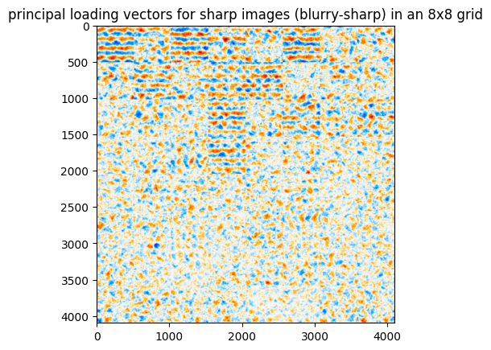
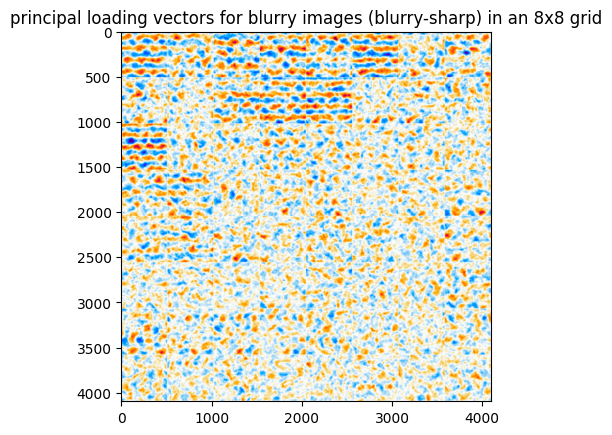

# hw2 
We investigate fusion and alignment between high and low-resolution fields, and local vs global representations in a diffusion model for one of the flows.

We find that while global representations are quite lossy and difficult to use regardless of fusion type, different resolution representation (including global) can produce similar eigenvectors when aligned with contrastive learning(see below and the documents for details).

